<div align="center">

# Mike E.S. Chokki

**Développeur Full Stack · Architecte Back-End & Mobile · Chef d'Exploitation IT**

[](https://git.io/typing-svg)

[](https://github.com/MikeCHOKKI)
[](https://linkedin.com/in/mikechokki)
[](https://twitter.com/MikeCHOKKI)
[](mailto:mikechokki5@gmail.com)

</div>

---

## À propos

Développeur basé entre **Cotonou (Bénin)** et **Dakar (Sénégal)**, je conçois des architectures back-end robustes, des applications cross-platform performantes et des solutions digitales scalables — du cahier des charges au déploiement en production.

Actuellement **Développeur d'Application chez Jilmonde Consulting** (Dakar), après avoir dirigé l'exploitation informatique chez RAB-TECH (Cotonou). Curieux, proactif, toujours en veille sur les technologies émergentes adaptées au contexte africain.

---

## Stack Technique

### Langages


### Frameworks & UI


### Bases de données & Infrastructure


### 🤖 AI Coding Agents


---

## Expérience

```
Développeur d'Application         Jilmonde Consulting — Dakar, Sénégal          Mai 2026 → Actuel
Chef d'Exploitation Informatique   RAB-TECH — Cotonou, Bénin                    Jan 2024 → Jan 2025
Prestataire Informatique           RAB-TECH — Bénin                             Jan 2021 → Jan 2023
Designer Textile CAD               Glo Djibe Industrial Zone — Bénin            Jan 2023 → Jan 2024
```

**Chez Jilmonde Consulting :** développement de nouvelles applications, intégration d'API tierces, ateliers fonctionnels & techniques, reporting projet.

**Chez RAB-TECH :** supervision d'équipe IT, gestion sécurité/incidents, transformation digitale, développement mobile/web/desktop en prestataire.

---

## Formation & Certifications

| Année | Institution | Titre |
|-------|-------------|-------|
| 2022 | IFRI Abomey Calavi | Licence en Génie Logiciel |
| 2017 | Collège Catholique Hibiscus, Parakou | Baccalauréat |
| — | Udemy | Flutter UI Bootcamp |
| — | Udemy | Dart & Flutter |

---

## Projets Phares

### 🎬 Prod+ Entertainment — Streaming & Monétisation

Plateforme de streaming haute performance avec système automatisé de partage de revenus et portail d'autonomie pour les acteurs.

<div align="center">
  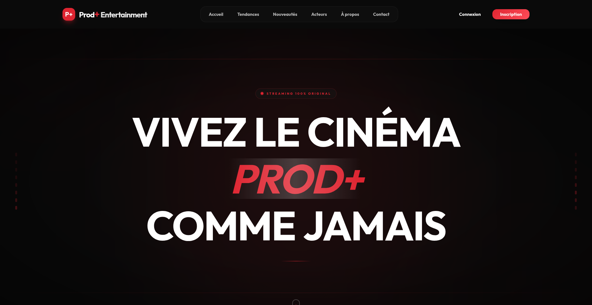 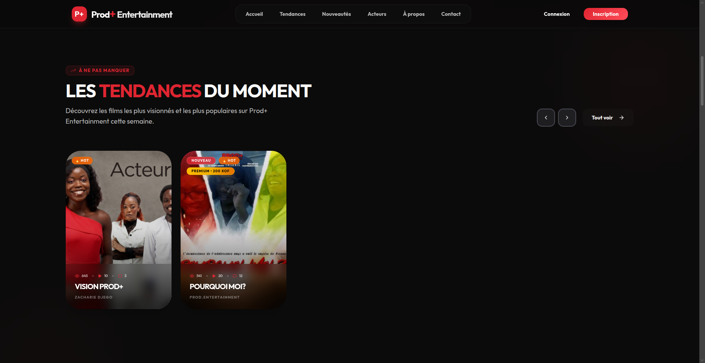 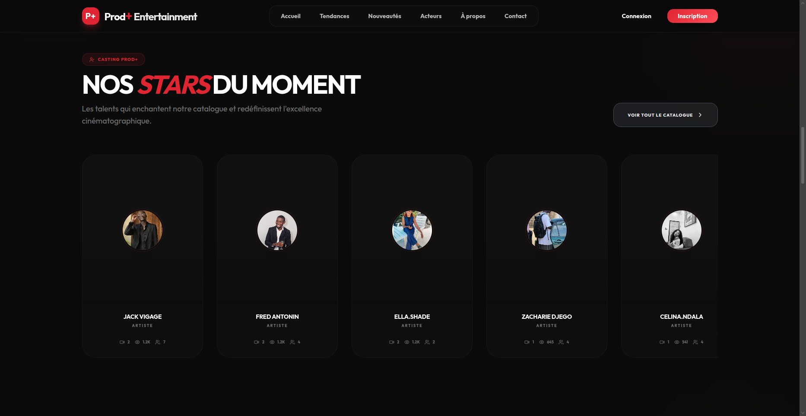
</div>

```yaml
Frontend  : Next.js 16, React 19, TypeScript, Tailwind v4, shadcn/ui
Backend   : PHP 8, MariaDB
Streaming : HLS.js
Infra     : Vercel (Frontend) · Hostinger (Backend)
```

**Points clés :** streaming adaptatif HLS · calcul automatique des revenus · RBAC + JWT + Rate Limiting

[](https://prodentertainment.vercel.app)

---

### 📱 Buzup — Écosystème Business-Client

Application multi-plateforme de mise en relation entreprises/clients : Annuaire, MonCV, BuzupPharma, BuzupSchool.

<div align="center">
  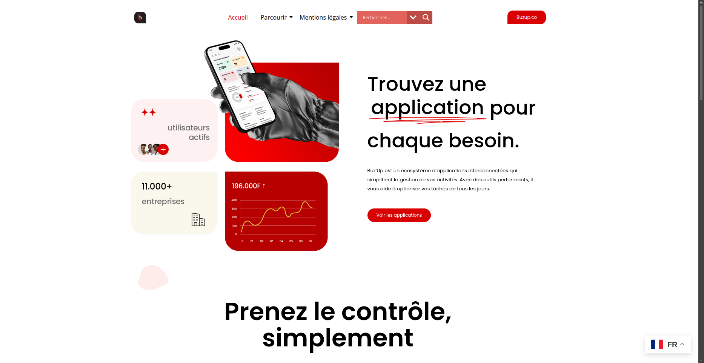 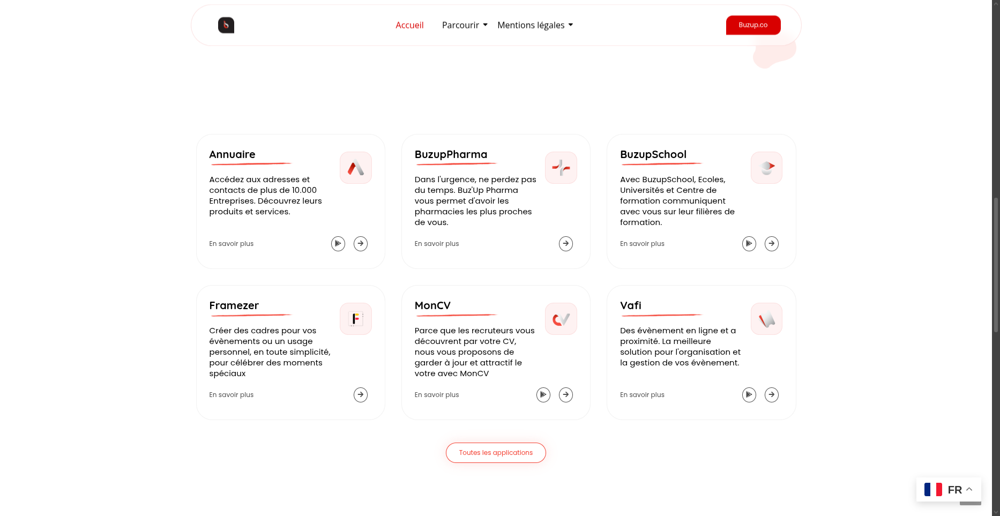 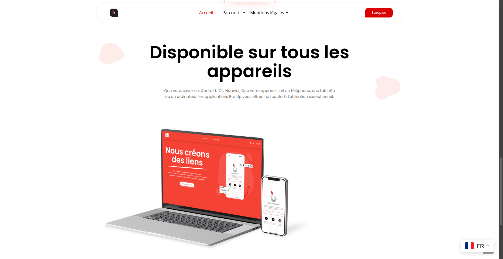
</div>

```yaml
Frontend : Flutter
Backend  : PHP
Database : MySQL, Firebase
Auth     : Firebase Auth
AI/ML    : Hugging Face
```

[](https://buzup.app/)

---

### 🎓 WeForgeEdu — Plateforme Edtech Francophone

Plateforme éducative de **[LucidForge Africa](https://lucidforgeafrica.com)** connectant les étudiants francophones d'Afrique de l'Ouest aux universités américaines. Accès souverain à l'enseignement supérieur américain (BYU Pathway) avec accompagnement linguistique et mentorat.

<div align="center">
  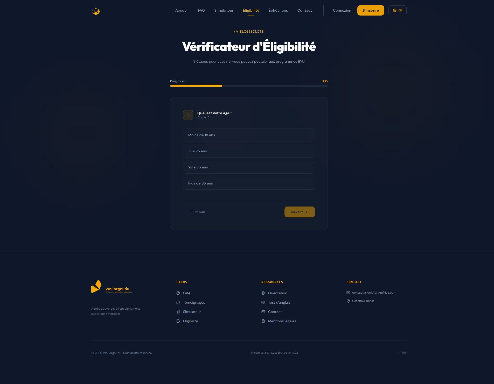 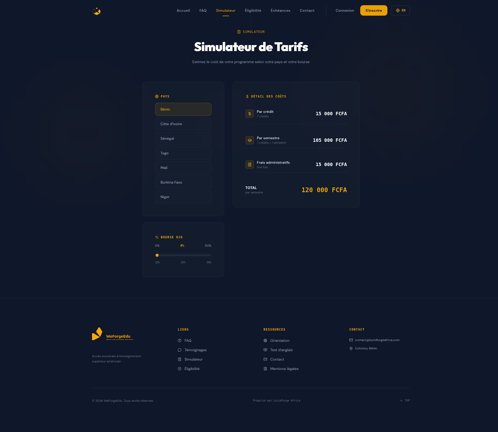 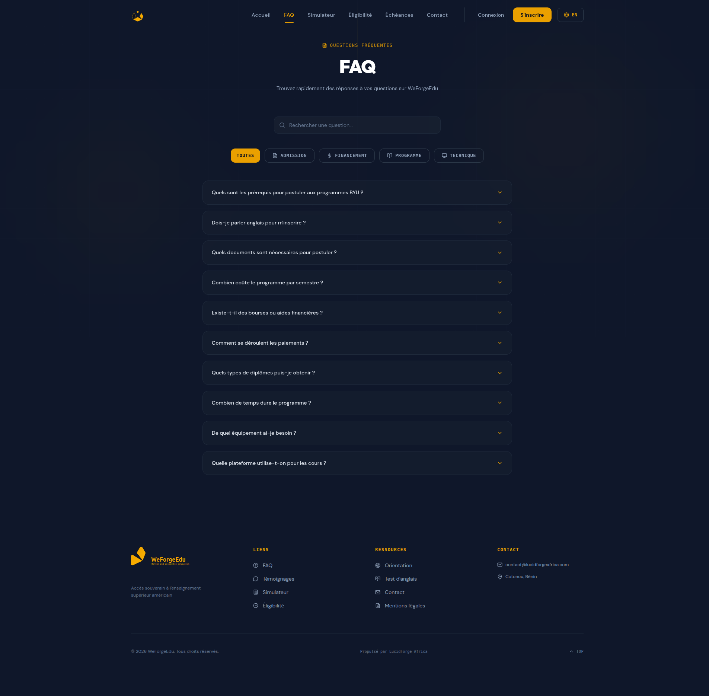
</div>

```yaml
Frontend : React, Vite, TypeScript, Tailwind CSS
Backend  : Laravel (PHP 8)
Client   : LucidForge Africa (Cotonou, Bénin)
Url      : wfe.lucidforgeafrica.com
```

**Points clés :** workflow de candidature BYU · simulateur de coûts & bourses · test d'anglais · orientation interactive · mentorat par diplômés ouest-africains

---

### 📚 Success-Delivery — E-Learning Mobile & Web

Plateforme d'apprentissage en ligne avec suivi de progression et synchronisation temps réel, dédiée à la reconversion professionnelle (métier de chauffeur-livreur).

<div align="center">
  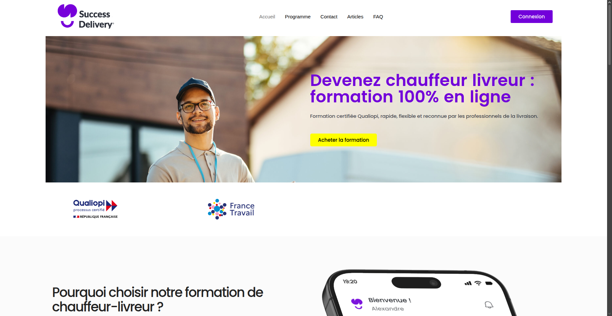 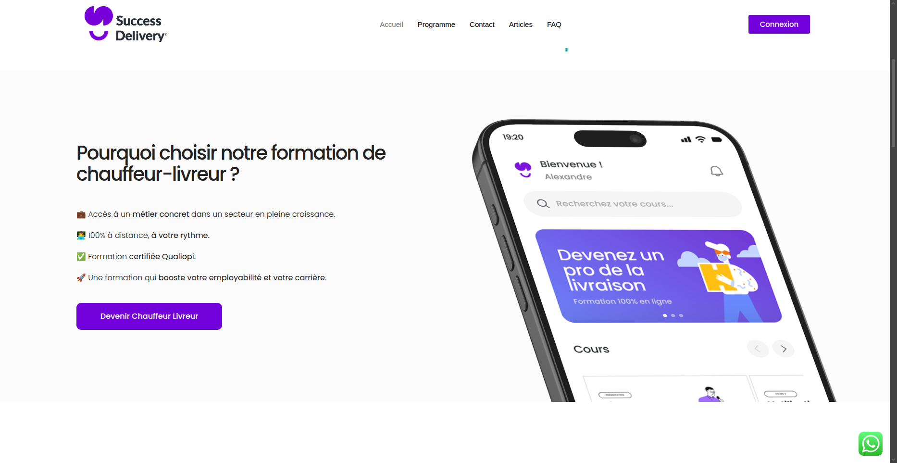
</div>

```yaml
Frontend : Flutter, Web Interface
Backend  : PHP
Database : MySQL, Firebase
Auth     : Firebase Auth
```

[](https://success-delivery.com/)

---

## Autres Projets

| Projet | Stack | Description |
|--------|-------|-------------|
| 🚀 **AfriStartup** | Flutter, Php, MySQL, Firebase | Financement participatif & investissement pour projets innovants |
| 🏫 **Scolariis** | Flutter, Php, MySQL, Firebase | Obtention de documents administratifs scolaires en ligne |
| 🎵 **229MusicRadio** | Flutter, Php, MySQL, Firebase | Diffusion musicale dédiée à la musique béninoise |
| 📺 **TOSSIN** | Flutter, Php, MySQL, Firebase | Suivi et conformité légale pour l'ORTB/SRTB |
| 👥 **PRODIJ (BDS)** | Flutter, Php, MySQL, Firebase | Suivi et insertion professionnelle des jeunes |
| 💱 **Xof Trader** | Flutter, PHP, MySQL | Échange sécurisé de cryptomonnaies |
| 🌸 **ELLES** | Flutter, PHP, Firebase | Application d'autonomisation féminine |
| ⚙️ **LucidCodeForge** | Next.js, Supabase | Développement d'applications sur mesure |
| 🔗 **Framezer & Vafi** | Flutter, Php, MySQL, Firebase | Communication et services divers |
| 🏠 **BTC Maison** | AutoCad | Design et correction de plans de construction |

---

## Open Source

| Dépôt | Stack | Description |
|-------|-------|-------------|
| [**lfa-cli-ai**](https://github.com/MikeCHOKKI/lfa-cli-ai) | Go · Cobra · Bubbletea | CLI d'installation et configuration d'OpenCode |
| [**lfa-cli-ui**](https://github.com/MikeCHOKKI/lfa-cli-ui) | React · Vite · Tailwind | Landing page interactive pour LFA CLI |
| [**php-auth**](https://github.com/MikeCHOKKI/php-auth) | PHP 8 · PostgreSQL · Docker | RBAC complet avec JWT RS256, tests, CI/CD |

---

<!-- DYNAMIC_STATS_START -->
<div align="center">

### 📊 GitHub Live Statistics

*Statistiques mises à jour automatiquement chaque jour.*

</div>
<!-- DYNAMIC_STATS_END -->

<!-- TOP_LANGUAGES_START -->
<div align="center">

### 💻 Langages les Plus Utilisés

</div>
<!-- TOP_LANGUAGES_END -->

<!-- TOP_REPOS_START -->
<div align="center">

### 🌟 Dépôts les Plus Populaires

</div>
<!-- TOP_REPOS_END -->

<!-- RECENT_ACTIVITY_START -->
<div align="center">

### ⚡ Activité Récente

</div>
<!-- RECENT_ACTIVITY_END -->

---

## 🌐 Langues


---

<div align="center">

**Construisons ensemble des solutions qui comptent pour l'Afrique. 🌍**

[](https://github.com/MikeCHOKKI)

<!-- WORKFLOW_CREDITS_START -->
<sub>🤖 Statistiques maintenues automatiquement par GitHub Actions</sub>
<!-- WORKFLOW_CREDITS_END -->

</div>
