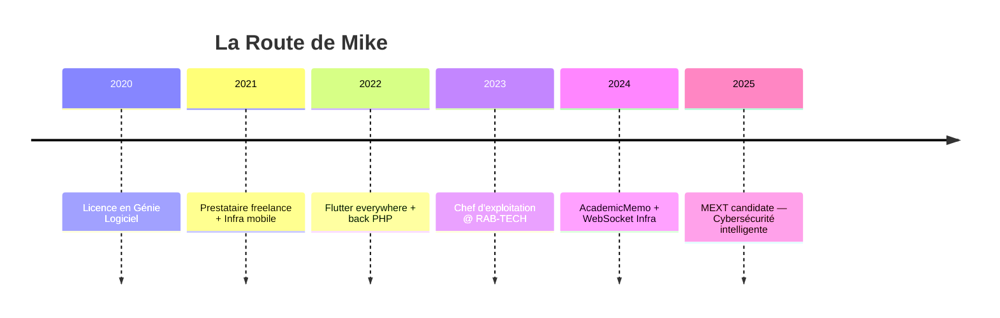

#  Hello, I'm Mike

<div align="center">


  

</div>

---

## 🎯 **Professional Overview**

<table>
<tr>
<td>

**🎓 Background**

- Licence en Génie Logiciel
- Spécialiste Full Stack & DevOps
- Chef d'exploitation informatique @ RAB-TECH
- Candidat à la bourse MEXT 2026 — Projet en cybersécurité intelligente

</td>
<td>

**🌍 Location**

- 📍 Cotonou, Bénin
- 🕒 Fuseau : WAT (UTC+1)
- 🗣️ Langues : 🇫🇷 Français · 🇬🇧 English

</td>
</tr>
</table>

---

## 🧠 **Vision & Aspiration**

> “Je code avec une boussole orientée vers l'impact.”  
> L’innovation technologique ne vaut que si elle résout un vrai problème.  
> Mon engagement : bâtir des solutions intelligentes et sécurisées au service de l’éducation, des entreprises et des communautés.

---

## 🛡️ **Current Focus Areas**

- 🔐 Cybersécurité comportementale assistée par IA
- 🧠 Systèmes éducatifs augmentés par l’intelligence artificielle (AcademicMemo)
- 📡 Infrastructure WebSocket haute disponibilité (Python ↔ PHP ↔ Flutter)
- ⚙️ Intégration continue & outils DevSecOps en environnement mobile

---

## 🚀 **Flagship Projects**

Incluant ton app de coaching académique, tes solutions temps réel, et autres :

<details>
<summary><b>📚 AcademicMemo - AI-Powered Learning Assistant</b></summary>

### 🎯 **Project Overview**

Solution intelligente pour étudiants et chercheurs : recommandation de sujets, rédaction assistée, relecture en direct, coaching personnalisé.

### 🛠️ **Tech Stack**

```yaml
Frontend: Flutter, Next.js
Backend: Python (FastAPI), PHP (API bridge)
Database: PostgreSQL, Firebase
Features: WebSocket, AI Integration, Smart Analytics
```

### ✨ **Key Features**

- 🤖 Assistant IA académique temps réel
- ✍️ Relecture automatique & scoring
- 📊 Recommandation de sujets & sources
- 📡 Canal WebSocket bidirectionnel (PHP ↔ Python ↔ Flutter)

</details>

---

## 💼 **Technical Arsenal**

- 
- 

---

## 🎖️ **Signature Strengths**

<table>
<tr>
<th>🌐 Domaines</th>
<th>⚙️ Expertise</th>
<th>💥 Compétences clés</th>
</tr>
<tr>
<td>AI-Powered EdTech</td>
<td>⭐⭐⭐⭐</td>
<td>NLP, Coaching IA, Pipeline FastAPI</td>
</tr>
<tr>
<td>WebSocket Architecture</td>
<td>⭐⭐⭐⭐⭐</td>
<td>Canaux dynamiques, auth + topic-based comm</td>
</tr>
<tr>
<td>Security & Scanning</td>
<td>⭐⭐⭐⭐</td>
<td>Advanced PHP scanner, file integrity check</td>
</tr>
<tr>
<td>Mobile & Web Full Stack</td>
<td>⭐⭐⭐⭐⭐</td>
<td>Flutter, PHP, Dart, Firebase</td>
</tr>
</table>

---

## 🧭 **Inspiration & Trajectoire**



---

## 📜 **Soft Skills & Ethique**

> 🎯 Esprit analytique, goût pour l’élégance du code  
> 🤝 Pragmatisme + vision long terme  
> 💬 Forte capacité à vulgariser la tech

---

## 🔗 **Réseaux & Collaboration**

<div align="center">

[](mailto:mikechokki5@gmail.com)
[](https://www.linkedin.com/in/mikechokki)
[](https://twitter.com/MikeCHOKKI)

</div>

---

<div align="center">

**Merci pour la visite. Que le code soit clair, le serveur stable, et l’ambition durable ! 🚀**


</div>
