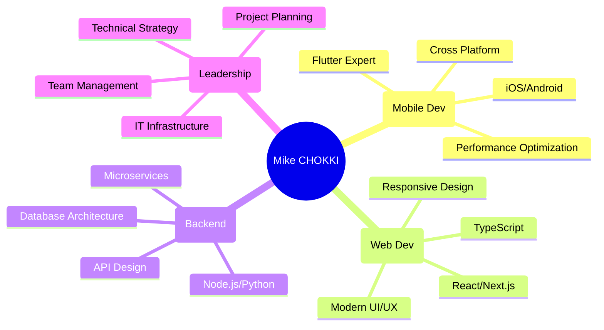
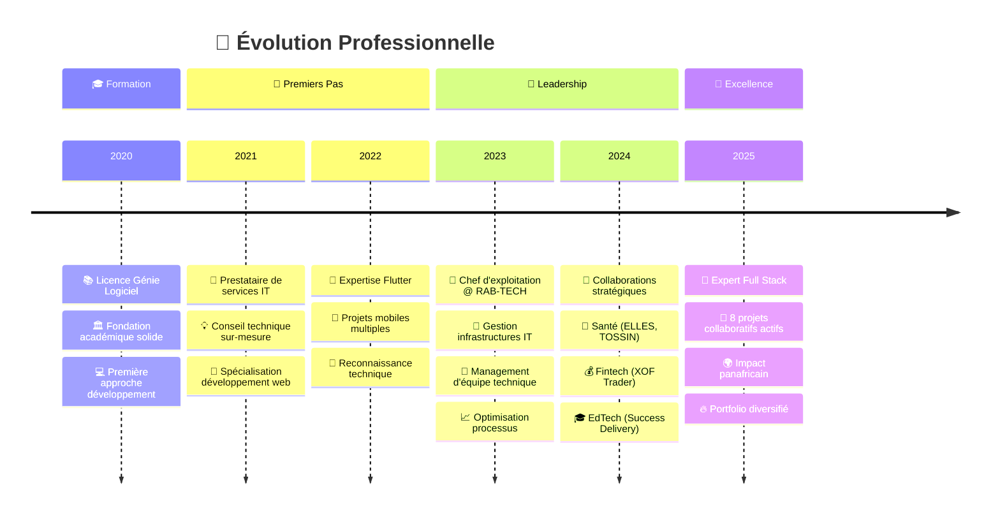

# <div align="center">🚀 Salut, je suis Mike CHOKKI</div>

<div align="center">


<p align="center">
  
  
  
</p>

<br/>

[](https://www.ekimart.ovh/)
[](mailto:mikechokki5@gmail.com)
[](https://www.linkedin.com/in/mikechokki)

</div>

<br/>

---

<div align="center">

## 🎯 **Profil Développeur**

</div>

<table align="center">
<tr>
<td style="text-align: left; width: 50%;">

### 🎓 **Formation & Carrière**

```
🎯 Licence en Génie Logiciel
💼 Chef d'exploitation @ RAB-TECH
🚀 Développeur Full Stack Expert
📱 Spécialiste développement mobile
```

</td>
<td style="width: 50%;">
<pre style="text-align: right; margin: 0;">
📍 Cotonou, Vedoko, Bénin
🕒 Fuseau : WAT (UTC+1)
🗣️ Français • Anglais • Japonais • Portugais
⚡ Passionné d'innovation africaine
</pre>
</td>
</tr>
</table>

<br/>

---

<div align="center">

## 🚀 **Portfolio de Projets**

*8 Applications développées avec impact réel*

</div>

<div align="center">

<details>
<summary><b>🎯 BUZUP - Écosystème Business Complet</b></summary>
<br/>


**🎨 Interface moderne** • **📊 Gestion centralisée** • **📱 Multi-plateforme**

```
✨ Écosystème d'applications interconnectées
🎯 Gestion complète des activités business
📱 Compatible : Android, iOS, Huawei, Web
⚡ Interface intuitive et performante
```

[🌐 Découvrir Buzup](https://buzup.app/)

</details>

<details>
<summary><b>🌸 ELLES - Santé Féminine Révolutionnaire</b></summary>
<br/>


**🩺 Prévention** • **📱 Suivi personnalisé** • **🤖 IA Médicale**

```
🌟 Première app santé féminine au Bénin
📅 Suivi cycle menstruel intelligent
🎗️ Dépistage cancer du sein (auto-palpation)
⚖️ Guide contraceptif complet
🤖 Assistant IA santé reproductive
```

**Impact :** Développée par IHSB pour promouvoir la santé des femmes africaines

</details>

<details>
<summary><b>💱 XOF TRADER - Crypto × Mobile Money</b></summary>
<br/>


**₿ Crypto Exchange** • **📱 Mobile Money** • **🌍 Focus Afrique**

```
💰 Conversion crypto → mobile money
🔐 Sécurité bancaire renforcée
⚡ Transactions instantanées
🌍 Optimisé pour le marché africain
```

[💱 Trader maintenant](https://xoftrader.com/)

</details>

<details>
<summary><b>📚 SUCCESS DELIVERY - Formation E-learning</b></summary>
<br/>


**🎓 Certification Qualiopi** • **📱 100% Mobile** • **⚡ À votre rythme**

```
🚚 Formation chauffeur-livreur
📱 Optimisé mobile-first
🎬 Vidéos courtes et ciblées
⏱️ 7h de formation flexible
✅ Certification reconnue
```

[📚 Commencer la formation](https://success-delivery.com/)

</details>

<details>
<summary><b>🚀 AFRI STARTUP - Hub Entrepreneurial</b></summary>
<br/>


**💼 Networking** • **💰 Financement** • **🌍 Réseau Panafricain**

```
🤝 Connexion entrepreneurs ↔ investisseurs
💡 Projets innovants africains
💰 Facilitation de financement
🌐 Réseau panafricain d'investisseurs
```

[🚀 Candidater maintenant](https://afri-startup.com/)

</details>

<details>
<summary><b>⚖️ TOSSIN - Révolution Juridique Audio</b></summary>
<br/>


**📚 5000 Lois** • **🎧 Audio Premium** • **🌍 Multi-pays**

```
📖 Base de données juridique complète
🎧 5000+ Lois et Codes en AUDIO
🌍 Textes juridiques mondiaux
⚖️ Accès démocratisé au droit
🔍 Recherche intelligente
```

**Innovation :** Première plateforme juridique audio au monde

[⚖️ Explorer TOSSIN](https://tossin.app/)

</details>

<details>
<summary><b>⚔️ LUCIDCODEFORGE - Solutions Tech</b></summary>
<br/>


**🛠️ Sur-mesure** • **🌍 Focus Afrique** • **🚀 Innovation**

```
⚡ Solutions technologiques personnalisées
🎯 Marché africain spécialisé
🔧 Développement from scratch
🌟 Innovation et créativité
```

[⚔️ Commander votre application](https://lucid-code-forge.vercel.app/)

</details>

</div>

<br/>

---

<div align="center">

## 💻 **Arsenal Technologique**

</div>

<div align="center">

### **🎯 Langages de Programmation**

<p align="center">
  
</p>

### **🎨 Frontend & Design**

<p align="center">
  
</p>

### **⚡ Backend & API**

<p align="center">
  
</p>

### **🗄️ Bases de Données**

<p align="center">
  
</p>

### **☁️ DevOps & Déploiement**

<p align="center">
  
</p>

</div>

<br/>

---

<div align="center">

## 📊 **Statistiques GitHub Live**

</div>

<div align="center">


</div>

<div align="center">
  


</div>

<br/>

<div align="center">

### 📈 **Métriques Développeur**

| 📊 **Métrique** | 🔢 **Valeur** |
|:---:|:---:|
| 📁 **Repositories** | 2 |
| ⭐ **Stars Earned** | 0 |
| 🍴 **Forks** | 1 |
| 👥 **Followers** | 106 |
| 🚀 **Projets Collaboratifs** | 8 |

</div>

<br/>

---

<div align="center">

## 🏆 **Expertise & Compétences**

</div>

<div align="center">



</div>

<br/>

<div align="center">

### **🎯 Niveaux de Maîtrise**

<table>
<tr>
<th>🔧 **Domaine**</th>
<th>⭐ **Niveau**</th>
<th>🛠️ **Technologies Phares**</th>
<th>📊 **Projets**</th>
</tr>
<tr>
<td>📱 **Mobile Development**</td>
<td>⭐⭐⭐⭐⭐</td>
<td>Flutter • Dart • Cross-platform</td>
<td>6/8</td>
</tr>
<tr>
<td>🌐 **Web Frontend**</td>
<td>⭐⭐⭐⭐⭐</td>
<td>React • Next.js • TypeScript</td>
<td>7/8</td>
</tr>
<tr>
<td>⚙️ **Backend Development**</td>
<td>⭐⭐⭐⭐</td>
<td>Node.js • Python • APIs RESTful</td>
<td>8/8</td>
</tr>
<tr>
<td>🗄️ **Database Management**</td>
<td>⭐⭐⭐⭐</td>
<td>MySQL • PostgreSQL • Firebase</td>
<td>8/8</td>
</tr>
<tr>
<td>☁️ **DevOps & Cloud**</td>
<td>⭐⭐⭐⭐</td>
<td>Docker • Vercel • AWS • CI/CD</td>
<td>8/8</td>
</tr>
<tr>
<td>👥 **IT Leadership**</td>
<td>⭐⭐⭐⭐⭐</td>
<td>Team Management • Infrastructure</td>
<td>RAB-TECH</td>
</tr>
</table>

</div>

<br/>

---

<div align="center">

## 🗺️ **Parcours Professionnel**

</div>

<div align="center">



</div>

<br/>

---

<div align="center">

## 🌟 **Vision & Mission**

</div>

<div align="center">

<table>
<tr>
<td align="center" width="50%">

### 🎯 **Ma Mission**

```
🚀 Démocratiser l'innovation tech en Afrique
📱 Créer des solutions impactantes
🌍 Connecter local et international  
⚡ Transformer les idées en réalité
```

</td>
<td align="center" width="50%">

### 🌟 **Ma Vision**

```
🏆 Devenir référence tech africaine
🤝 Collaborations internationales
🌱 Mentorer nouvelle génération
🔮 Anticiper besoins futurs
```

</td>
</tr>
</table>

</div>

<br/>

---

<div align="center">

## 💎 **Valeurs & Approche**

</div>

<div align="center">

```
╭─────────────────────────────────────────────────╮
│  🎯 EXCELLENCE TECHNIQUE                        │
│     └─ Code propre et maintenable               │
│     └─ Performance optimisée                    │
│     └─ Scalabilité pensée dès le départ         │
│                                                 │
│  🤝 COLLABORATION ACTIVE                        │
│     └─ Écoute des besoins clients               │
│     └─ Communication transparente               │
│     └─ Travail d'équipe efficace                │
│                                                 │
│  🚀 INNOVATION CONTINUE                         │
│     └─ Veille technologique constante           │
│     └─ Adoption technologies émergentes         │
│     └─ Solutions créatives aux défis            │
│                                                 │
│  🌍 IMPACT SOCIAL                               │
│     └─ Technologies au service de l'humain      │
│     └─ Développement durable                    │
│     └─ Inclusion numérique                      │
╰─────────────────────────────────────────────────╯
```

</div>

<br/>

---

<div align="center">

## 📞 **Connectons-nous !**

</div>

<div align="center">

[](https://www.ekimart.ovh/)

<br/>

[](mailto:mikechokki5@gmail.com)
[](https://www.linkedin.com/in/mikechokki)
[](https://twitter.com/MikeCHOKKI)

<br/>

### 📍 **Informations Pratiques**

```
🌍 Localisation : Cotonou, Vedoko, Bénin
🕒 Fuseau horaire : WAT (UTC+1)
🗣️ Langues : Français • Anglais • Japonais • Portugais
💼 Statut : Disponible pour nouvelles collaborations
⚡ Réponse : Sous 24h maximum
```

</div>

<br/>

---

<div align="center">

## 🎨 **Centres d'Intérêt & Loisirs**

</div>

<div align="center">

```
🚀 Innovation Tech Africaine    🌍 Solutions Locales Globales
📚 Veille Technologique         🎯 Startups & Entrepreneuriat  
🤖 Intelligence Artificielle    📱 UX/UI Design Innovation
🌱 Tech for Good               🎮 Gaming & Développement
🎵 Musique & Créativité        ✈️ Voyages & Cultures
```

</div>

<br/>

---

<div align="center">


<br/><br/>

**✨ Ensemble, révolutionnons la tech africaine ! ✨**

<br/>

---

<div align="right">

*🤖 README maintenu automatiquement par GitHub Actions*
*📅 Dernière mise à jour : Août 2025*

</div>

</div>
