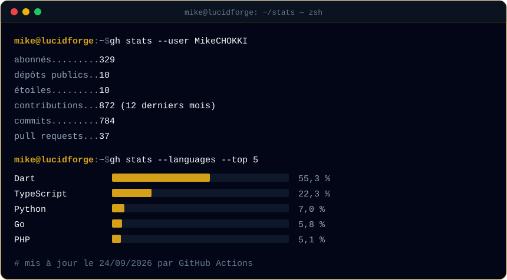

<div align="center">



<br/>

[](https://lucidforgeafrica.com)
[](https://github.com/forgelab-dev)
[](https://linkedin.com/in/mikechokki)
[](https://x.com/MikeChokki2)
[](mailto:mikechokki5@gmail.com)

</div>

## `$ cat about.md`

Je construis des **infrastructures numériques souveraines pour l'Afrique de l'Ouest** : des produits qui tournent sur les serveurs de leurs propriétaires, se paient en FCFA et se supportent en français.

Côté technique, j'associe la performance de **Go** pour les services concurrents, la rigueur de **Spring Boot** pour les systèmes transactionnels, et **Laravel / React** pour livrer vite des produits utilisables. Basé entre **Dakar** et **Cotonou**.

```ts
const mike = {
  role:       "Fondateur @ LucidForge Africa · Back-End Engineer & Architect",
  jour:       "Développeur d'Application @ Jilmonde Consulting (Dakar)",
  focus:      ["Systèmes distribués", "Event Sourcing / CQRS", "Souveraineté des données"],
  apprend:    ["Kubernetes", "Kafka Streams", "Go concurrency avancée"],
  devise:     "Du cahier des charges au déploiement.",
};
```

## `$ ls ~/lucidforge-africa`

| Produit | Ce que c'est | Stack | État |
|:--|:--|:--|:--|
| **We Forge Commerce** | Boutique e-commerce en marque blanche, livrée sous licence à chaque client | `Laravel 13` `React 19 + Inertia` `MySQL` `KKiaPay/FedaPay` | Boutiques clientes en production |
| [**ForgeNet**](https://github.com/forgelab-dev/lfa-forgenet) | Cloud souverain auto-hébergé, avec IA sysadmin 100 % locale (Ollama) | `Go` `React` `Flutter` `Caddy` | Pré-alpha, open source (Apache 2.0) |
| [**lucid_core_flutter**](https://pub.dev/packages/lucid_core_flutter) | Socle Flutter commun : client API, auth, stockage chiffré, thème, widgets | `Dart` `Flutter` | Publié sur pub.dev, éditeur vérifié |
| **Brain** | Socle d'infrastructure mutualisé des plateformes LFA | `Traefik v3` `PostgreSQL` `Redis` `MinIO` `Elixir` | En construction |
| [**ForgeLab**](https://github.com/forgelab-dev) | Le laboratoire open source de LucidForge Africa | — | Contributions bienvenues |

## `$ cat stack.yml`

```yaml
langages:    [Go, Java, PHP, TypeScript, Dart, Python]
back-end:    [Spring Boot, Laravel, gRPC, Kafka, FastAPI]
front-end:   [React, Inertia, Next.js, Angular, Tailwind, Flutter]
données:     [PostgreSQL, MySQL, Redis, MinIO, MariaDB]
infra:       [Docker, Traefik, Caddy, GitHub Actions, GHCR, VPS]
paiement:    [KKiaPay, FedaPay]   # mobile money & carte, zone FCFA
qualité:     [JUnit 5, Testcontainers, PHPUnit, PHPStan, Vitest]
outils_ia:   [Claude Code, OpenCode, Windsurf, Ollama]
```

## `$ ls ~/projects --featured`

| Projet | Description | Stack |
|:--|:--|:--|
| [**core-banking**](https://github.com/MikeCHOKKI/core-banking) | Système bancaire Event Sourcing + CQRS : 6 modules Maven, 68 tests, idempotence Redis | `Java 21` `Spring Boot 3.4` `Kafka KRaft` `PostgreSQL` |
| [**nexusflow**](https://github.com/MikeCHOKKI/nexusflow) · [captures](screenshots/nexusflow) | Microservices polyglottes : passerelle Go, gRPC, Redis Pub/Sub, 10 conteneurs | `Go` `PHP` `React` `gRPC` |
| [**Prod+ Entertainment**](https://prodentertainment.vercel.app) · [captures](screenshots/prodplus) | Streaming HLS avec partage automatique des revenus, livré pour CCS Production | `Next.js 16` `PHP 8` `MariaDB` `HLS.js` |
| [**tiktok-agent**](https://github.com/MikeCHOKKI/tiktok-agent) | Agent de contenu autonome piloté depuis Discord, 46 tests, coût d'infra nul | `Python` `discord.py` `Llama 3` `SDXL` |
| [**Buzup**](https://buzup.app) · [captures](screenshots/buzup) | Écosystème business-to-client : annuaire, CV, pharmacies, école | `Flutter` `PHP` `Firebase` |
| [**WeForgeEdu**](https://wfe.lucidforgeafrica.com) · [captures](screenshots/weforgeedu) | Edtech francophone : candidature BYU Pathway, simulateur de coûts, mentorat | `React` `Vite` `Laravel` |
| [**Success-Delivery**](https://success-delivery.com) · [captures](screenshots/success_delivery) | E-learning mobile et web dédié à la reconversion chauffeur-livreur | `Flutter` `PHP` `Firebase` |

<details>
<summary><b>Autres projets et open source</b></summary>

<br/>

| Dépôt | Stack | Description |
|:--|:--|:--|
| [**lfa-cli-ai**](https://github.com/MikeCHOKKI/lfa-cli-ai) | `Go` `Cobra` `Bubbletea` | CLI d'installation et de configuration d'OpenCode |
| [**lfa-cli-ui**](https://github.com/MikeCHOKKI/lfa-cli-ui) | `React` `Vite` `Tailwind` | Site de présentation du CLI |
| [**php-auth**](https://github.com/MikeCHOKKI/php-auth) | `PHP 8` `PostgreSQL` `Docker` | RBAC granulaire + JWT RS256, rotation des refresh tokens |
| [**yt-downloader**](https://github.com/MikeCHOKKI/yt-downloader) | `TypeScript` | CLI interactive de téléchargement YouTube |
| **AfriStartup · Scolariis · 229MusicRadio · TOSSIN · PRODIJ · Xof Trader · ELLES** | `Flutter` `PHP` `MySQL` `Firebase` | Applications livrées pour des clients et projets béninois |

</details>

## `$ history --career`

```console
2026-02 → …        Fondateur & CEO              LucidForge Africa     Cotonou, BJ
2026-05 → …        Développeur d'Application    Jilmonde Consulting   Dakar, SN
2024-10 → 2025-10  Chef d'Exploitation IT       RAB-TECH              Cotonou, BJ
2023-07 → 2024-01  Designer Textile CAD         Glo Djibe (GDIZ)      BJ
2021-06 → 2023-07  Prestataire Informatique     RAB-TECH              BJ

2022             Licence en Génie Logiciel    IFRI Abomey-Calavi
2017             Baccalauréat                 Collège Hibiscus, Parakou
```

## `$ gh stats`

<div align="center">



<br/><br/>


</div>

## `$ contact --list`

- 📧 **mikechokki5@gmail.com** — missions, collaborations, questions techniques
- 🌍 [lucidforgeafrica.com](https://lucidforgeafrica.com) — LucidForge Africa
- 💼 [linkedin.com/in/mikechokki](https://linkedin.com/in/mikechokki) · 𝕏 [@MikeChokki2](https://x.com/MikeChokki2)
- 💜 [github.com/sponsors/forgelab-dev](https://github.com/sponsors/forgelab-dev) — soutenir nos projets open source

<div align="center">
<br/>
<sub><code>mike@lucidforge:~$ exit</code> — merci d'avoir lu jusqu'ici. Construisons des choses qui comptent pour l'Afrique.</sub>
</div>
