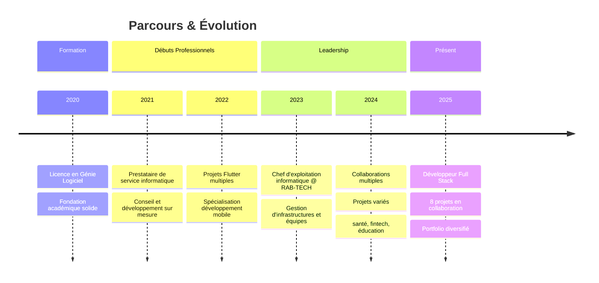

# <div align="center">👋 Hello, I'm Mike CHOKKI</div>

<div align="center">


[](https://www.ekimart.ovh/)
[](mailto:mikechokki5@gmail.com)


</div>

---

## 🎯 **À Propos**

<table>
<tr>
<td>

**🎓 Formation & Expérience**
- Licence en Génie Logiciel
- Chef d'exploitation informatique @ RAB-TECH
- Développeur Full Stack spécialisé mobile

</td>
<td>

**🌍 Informations**
- 📍 Cotonou, Vedoko, Bénin
- 🕒 Fuseau : WAT (UTC+1)
- 🗣️ Français, Anglais, Japonais, Portugais

</td>
</tr>
</table>

---

## 🚀 **Projets & Collaborations**

<div align="center">

### 📱 **Applications sur lesquelles j'ai collaboré**

</div>

<details>
<summary><b>🎯 Buzup - Écosystème d'Applications</b></summary>

<div align="center">

[](https://buzup.app/)

</div>

**À propos :** Buz'Up est un écosystème d'applications interconnectées qui simplifient la gestion de vos activités. Avec des outils intuitifs et performants, il vous aide à gagner du temps et à optimiser vos tâches de tous les jours.

**Spécificités :**
- Interface claire et intuitive pour centraliser les informations d'entreprise
- Gestion des apparitions, consultations, produits, événements et statistiques
- Disponible sur tous les appareils : Android, iOs, Huawei, téléphones, tablettes et ordinateurs

</details>

<details>
<summary><b>🌸 ELLES - Application de Santé Féminine</b></summary>

<div align="center">

[](https://elles.app/)

</div>

**Mission :** ELLES est une application qui agit sur la prévention à travers 3 piliers principaux: l'accès à l'information fiable, le conseil médical et bientôt la distribution de produits

**Développée par :** Innovative Health Solutions Benin (IHSB) - une entreprise sociale utilisant l'innovation pour promouvoir la santé des femmes et des filles et combattre les inégalités du genre en matière de santé

**Fonctionnalités principales :**
- 📅 Suivi du cycle menstruel
- 🎗️ Dépistage du cancer du sein avec l'auto-palpation
- ⚖️ Information sur les méthodes contraceptives
- 🤖 Assistance en ligne pour les préoccupations sur la santé sexuelle et reproductive

**Impact :** ELLES est la première application exclusivement dédiée à la santé de la femme au Bénin

</details>

<details>
<summary><b>💱 XOF Trader - Plateforme Crypto</b></summary>

<div align="center">

[](https://xoftrader.com/)

</div>

**Focus :** Convertissez vos cryptomonnaies en mobile money

Plateforme spécialisée dans l'échange de cryptomonnaies avec intégration du mobile money pour le marché africain.

</details>

<details>
<summary><b>📚 Success Delivery - Plateforme de Formation</b></summary>

<div align="center">

[](https://success-delivery.com/)

</div>

**Spécialisation :** Formation de chauffeur-livreur flexible, 100% en ligne

**Caractéristiques :**
- Formation certifiée Qualiopi
- 100% à distance, à votre rythme
- Formation de 7h selon votre propre rythme
- Accessible depuis mobile avec vidéos courtes et ciblées

</details>

<details>
<summary><b>🚀 Afri Startup - Hub Entrepreneurial</b></summary>

<div align="center">

[](https://afri-startup.com/)

</div>

**Objectif :** Vous cherchez du financement pour votre projet innovant? Candidatez maintenant et profitez de notre réseau d'investisseurs

Plateforme dédiée à la connexion entre entrepreneurs africains et investisseurs.

</details>

<details>
<summary><b>⚖️ TOSSIN - Base de Données Juridique</b></summary>

<div align="center">

[](https://tossin.app/)

</div>

**Mission :** TOSSIN est la base de données des Lois, Codes, Traités des pays du monde en texte et en Audio. Notre vocation est de permettre un accès plus facile des citoyens aux textes juridiques de leur pays.

Innovation majeure : **5000 Lois et Codes en audio** pour faciliter l'accès au droit.

</details>

<details>
<summary><b>⚔️ LucidCodeForge - Solutions Tech</b></summary>

<div align="center">

[](https://lucid-code-forge.vercel.app/)

</div>

**Vision :** Solutions technologiques sur-mesure pour l'Afrique

Projet personnel axé sur l'innovation technologique pour le marché africain.

</details>

---

## 💻 **Stack Technologique**

<div align="center">

### **Langages & Frameworks**


### **Frontend & Mobile**


### **Backend & Databases**


### **DevOps & Tools**


</div>

---

## 📊 **Statistiques GitHub**

<div align="center">


</div>

<!-- DYNAMIC_STATS_START -->

<div align="center">

### 📊 **Live GitHub Statistics**

| Metric | Value |
|--------|-------|
| 📁 Total Repositories | 2 |
| 🔓 Public Repositories | 2 |
| 🔒 Private Repositories | 0 |
| ⭐ Total Stars Earned | 0 |
| 🍴 Total Forks | 1 |
| 👀 Total Watchers | 0 |
| 👥 Followers | 107 |

*Last updated: 8/16/2025*

</div>
<!-- DYNAMIC_STATS_END -->

<!-- TOP_LANGUAGES_START -->

<div align="center">

### 💻 **Most Used Languages (Live Data)**

1. **TypeScript** - 100.0%

</div>
<!-- TOP_LANGUAGES_END -->

<!-- TOP_REPOS_START -->

<div align="center">

### 🌟 **Top Repositories**


#### [MikeCHOKKI](https://github.com/MikeCHOKKI/MikeCHOKKI) 🔓
*No description*
- **Language:** N/A
- **Stars:** ⭐ 0 | **Forks:** 🍴 0


#### [yt-downloader](https://github.com/MikeCHOKKI/yt-downloader) 🔓
*YT Downloader est une application CLI interactive permettant de télécharger des vidéos et playlists YouTube avec des fonctionnalités avancées. Contrairement aux outils classiques, elle propose une interface intuitive avec des menus interactifs, une gestion des configurations persistantes et une expérience de téléchargement améliorée.*
- **Language:** TypeScript
- **Stars:** ⭐ 0 | **Forks:** 🍴 1


</div>
<!-- TOP_REPOS_END -->

<!-- RECENT_ACTIVITY_START -->

<div align="center">

### ⚡ **Recent Activity**

- **Pushed 1 commit(s)** in [MikeCHOKKI/MikeCHOKKI] - *8/16/2025*
- **Pushed 1 commit(s)** in [MikeCHOKKI/MikeCHOKKI] - *8/16/2025*
- **Pushed 1 commit(s)** in [MikeCHOKKI/MikeCHOKKI] - *8/16/2025*
- **Pushed 1 commit(s)** in [MikeCHOKKI/MikeCHOKKI] - *8/16/2025*
- **Pushed 1 commit(s)** in [MikeCHOKKI/MikeCHOKKI] - *8/16/2025*

</div>
<!-- RECENT_ACTIVITY_END -->

---

## 🎓 **Parcours Professionnel**

<div align="center">



</div>

---

## 🏆 **Domaines d'Expertise**

<div align="center">

<table>
<tr>
<th>🎯 Domaine</th>
<th>📊 Expérience</th>
<th>🔧 Technologies Clés</th>
</tr>
<tr>
<td>📱 **Développement Mobile**</td>
<td>⭐⭐⭐⭐⭐</td>
<td>Flutter, Dart, Cross-platform</td>
</tr>
<tr>
<td>🌐 **Développement Web**</td>
<td>⭐⭐⭐⭐⭐</td>
<td>React, Next.js, TypeScript</td>
</tr>
<tr>
<td>🔧 **Backend Development**</td>
<td>⭐⭐⭐⭐</td>
<td>Node.js, PHP, Python, APIs</td>
</tr>
<tr>
<td>🗄️ **Bases de Données**</td>
<td>⭐⭐⭐⭐</td>
<td>MySQL, PostgreSQL, Firebase</td>
</tr>
<tr>
<td>☁️ **DevOps & Déploiement**</td>
<td>⭐⭐⭐⭐</td>
<td>Docker, Vercel, CI/CD</td>
</tr>
<tr>
<td>👥 **Gestion IT**</td>
<td>⭐⭐⭐⭐⭐</td>
<td>Infrastructure, Leadership d'équipe</td>
</tr>
</table>

</div>

---

## 🌐 **Me Contacter**

<div align="center">

[](https://www.ekimart.ovh/)
[](mailto:mikechokki5@gmail.com)
[](https://www.linkedin.com/in/mikechokki)
[](https://twitter.com/MikeCHOKKI)

**📍 Localisation :** Cotonou, Vedoko, Bénin  
**🕒 Fuseau horaire :** WAT (UTC+1)  
**🗣️ Langues :** Français, Anglais, Japonais, Portugais

</div>

---

## 💡 **Centres d'Intérêt**

<div align="center">

```ascii
╔══════════════════════════════════════════════════╗
║  🚀 Innovation technologique pour l'Afrique      ║
║  📱 Applications mobiles cross-platform          ║
║  🎯 Solutions pratiques aux défis locaux         ║
║  🌍 Impact social par la technologie             ║
╚══════════════════════════════════════════════════╝
```

</div>

---

<div align="center">


**✨ Merci de visiter mon profil ! Toujours ouvert aux collaborations sur des projets innovants ! 🚀**

---

<div align="right" style="margin-top: 2rem">

🤖 **Maintenu automatiquement par GitHub Actions**

</div>

</div>
