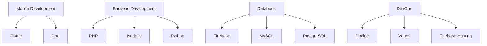
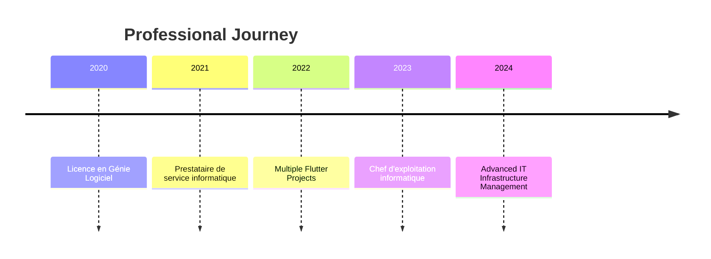

<!-- 🚧 MAINTENANCE BANNER START -->

<div align="center">


**Ce dépôt est actuellement en maintenance. Certaines sections peuvent être incomplètes ou en cours de mise à jour. Merci de votre compréhension.**

</div>

<!-- 🚧 MAINTENANCE BANNER END -->

#  Hello, I'm Mike

<div align="center">


  

</div>

---

## 🎯 **Professional Overview**

<table>
<tr>
<td>

**🎓 Background**

- Licence en Génie Logiciel
- Prestataire de service informatique
- Chef d'exploitation informatique @ RAB-TECH

</td>
<td>

**🌍 Location**

- 📍 Cotonou, Vedoko
- 🕒 Timezone: WAT (UTC+1)
- 🗣️ Languages: French, English

</td>
</tr>
</table>

---

## 🚀 **Featured Projects**

<details>
<summary><b>📱 Buzup - Business-Client Connection Platform</b></summary>

### 🎯 **Project Overview**

Application mobile et desktop cross-platform facilitant la mise en relation entre entreprises et clients.

### 🛠️ **Tech Stack**

```yaml
Frontend: Flutter
Backend: PHP
Database: MySQL, Firebase
Authentication: Firebase Auth
Hosting: Custom Infrastructure
```

### ✨ **Key Features**

- 🔐 Secure Firebase Authentication
- 🛡️ PHP-powered secure API
- 📱 Cross-platform compatibility
- 🎨 Modern UI/UX design

### 🔗 **Links**

[](https://buzup.app/)

</details>

<details>
<summary><b>📚 Success-Delivery - E-Learning Platform</b></summary>

### 🎯 **Project Overview**

Plateforme mobile et web pour l'apprentissage de cours en ligne.

### 🛠️ **Tech Stack**

```yaml
Frontend: Flutter, Web Interface
Backend: PHP
Database: MySQL, Firebase
Authentication: Firebase Auth
```

### ✨ **Key Features**

- 📖 Interactive learning modules
- 👥 Multi-user support
- 📊 Progress tracking
- 🔄 Real-time synchronization

### 🔗 **Links**

[](https://success-delivery.com/)

</details>

<details>
<summary><b>💱 Xof Trader - Cryptocurrency Exchange</b></summary>

### 🎯 **Project Overview**

Application mobile dédiée à l'échange sécurisé de cryptomonnaies.

### 🛠️ **Tech Stack**

```yaml
Frontend: Flutter
Backend: PHP
Database: MySQL, Firebase
Security: Advanced encryption
```

### ✨ **Key Features**

- ₿ Secure crypto trading
- 📈 Real-time market data
- 🔒 Multi-layer security
- 📱 Responsive mobile design

### 🔗 **Links**

[](https://app.xoftrader.com/)

</details>

<details>
<summary><b>🌸 ELLES, l'amie intime de la femme et de la jeune fille.</b></summary>

### 🎯 **Project Overview**

Une application engagée pour l’autonomisation féminine, qui contribue activement à bâtir une Afrique où chaque femme et chaque jeune fille exerce pleinement ses droits, maîtrise sa santé reproductive, et s’épanouit tant sur le plan économique que professionnel.

### 🛠️ **Tech Stack**

```yaml
Frontend: Flutter
Backend: PHP
Database: MySQL, Firebase
```

### ✨ **Key Features**

- 📆 Suivi du cycle menstruel
- 🎗️ Dépistage du cancer du sein
- ⚖️ Méthodes contraceptives
- 🤖 Assistance en ligne

</details>

---

## 💻 **Technical Arsenal**

<div align="center">

### **Languages & Frameworks**


### **Frontend Technologies**


### **Backend & Frameworks**


### **Databases**


### **DevOps & Tools**


</div>

---

## 📊 **GitHub Analytics**

<!-- <div align="center">

  
  

</div> -->

<div align="center">


</div>

<!-- DYNAMIC_STATS_START -->

<div align="center">

### 📊 **Live GitHub Statistics**

| Metric | Value |
|--------|-------|
| 📁 Total Repositories | 2 |
| 🔓 Public Repositories | 2 |
| 🔒 Private Repositories | 0 |
| ⭐ Total Stars Earned | 0 |
| 🍴 Total Forks | 1 |
| 👀 Total Watchers | 0 |
| 👥 Followers | 136 |

*Last updated: 9/15/2025*

</div>
<!-- DYNAMIC_STATS_END -->

<!-- ### **Contribution Graph** -->
<!--

 -->

---

## 🎯 **Most Used Tech Stack**

<div align="center">



</div>

---

## 🏆 **Professional Experience Matrix**

<table align="center">
<tr>
<th>Domain</th>
<th>Experience Level</th>
<th>Key Skills</th>
</tr>
<tr>
<td>🏗️ Software Architecture</td>
<td>⭐⭐⭐⭐⭐</td>
<td>System Design, Scalable Solutions</td>
</tr>
<tr>
<td>📱 Mobile Development</td>
<td>⭐⭐⭐⭐⭐</td>
<td>Flutter, Cross-platform Apps</td>
</tr>
<tr>
<td>🌐 Backend Development</td>
<td>⭐⭐⭐⭐⭐</td>
<td>PHP, Node.js, API Design</td>
</tr>
<tr>
<td>🗄️ Database Management</td>
<td>⭐⭐⭐⭐</td>
<td>MySQL, Firebase, PostgreSQL</td>
</tr>
<tr>
<td>🔧 IT Operations</td>
<td>⭐⭐⭐⭐⭐</td>
<td>Infrastructure, Team Management</td>
</tr>
</table>

---

## 🌐 **Connect With Me**

<div align="center">

[](mailto:mikechokki5@gmail.com)
[](https://www.linkedin.com/in/mikechokki)
[](https://twitter.com/MikeCHOKKI)

</div>

---

## 📈 **Activity Timeline**



---

## 🎨 **Fun Facts & Interests**

<div align="center">

```ascii
╔══════════════════════════════════════╗
║  🚀 Always learning new technologies  ║
║  💡 Problem-solving enthusiast        ║
║  🎯 Quality-focused developer         ║
╚══════════════════════════════════════╝
```

</div>

---

<div align="center">

**Thanks for visiting my profile! Let's build something amazing together! 🚀**


</div>

---

---

</div><!-- WORKFLOW_CREDITS_START --><div align="right" style="margin-top: 2rem">
🤖 Maintenu automatiquement par GitHub Actions

</div> <!-- WORKFLOW_CREDITS_END -->

---
